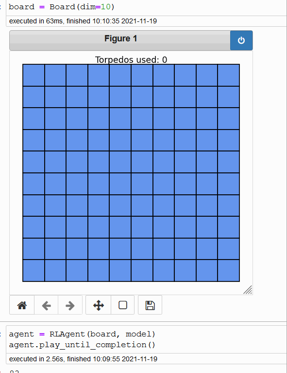

# battleship

Software gent trained to play [battleship board game](https://www.hasbro.com/common/instruct/Battleship.PDF) using reinforcement learning.  Implementation using [openAI gym](https://gym.openai.com/) and [PPO algorithm](https://arxiv.org/pdf/1707.06347.pdf)    

Inspired by [Practical-RL by Quansight](https://github.com/Quansight/Practical-RL/)  


## Overview
This version of Battleship only considers a single player's viewpoint.  This repository provides an implementation of the Battleship board game with interactive and debugging features, an implementation of trivial AI agents (brute force, random search), and an implementation of reinforcement learning to build an agent to effectively play Battleship.  The RL agent's policy was trained using Proximal Policy Optimization (PPO).  

```
conda env create --file environment.yml
```

## Playing the game
View the `00-game-mechanics` notebook to see how to run the game.  If playing in a jupyter notebook, the `%matplotlib notebook` magic command must be run first.  

The game itself consists of a Board object and Ship objects.  The Board stores the state of the game and provides behaviors to launch a torpedo on the grid and report if the game has concluded (all ships sunk)  The Ship object supports the Board object by containing and providing behaviors associated with the battleships.  View the `board.py` file on more info on how to create custom board states.  Currently, on the default game grid (according to the rulebook) is implemented.  


## logical agents

### design 1 - brute force

Trivial solution of randomly probing until the game ends.   Average game length is 95.342 turns/torpedos.  


### design 2 - slightly smarter expert system

This solution leverages the idea that future successful hits will be near prior successful hits.  The agent switches between two modes:  searching and hunting.  When searching, it randomly probes for a hit.  Upon hit, it switches to hunting and will search the region around the most recent hit using a stored fringe queue.  Once the fringe is empty, it will return to searching.  This solution comes from [this blogpost](https://www.datagenetics.com/blog/december32011/).   

Average game length is 67.202.  


This idea can be further searching only a parody space (half of the board) or by implementing a probabilitic board state, but I only wanted a baseline to compare the RL agent to, so this will be good enough for now.  


## RL agent and reward scheme

### design 1

The first iteration of the RL agent used this action and observation space: 
```python
# Action space is (i, j) where i, j belong to {0...9}.  
#   The tuple represents coordinates to launch the next torpedo 
self.action_space = gym.spaces.MultiDiscrete((BOARD_DIM, BOARD_DIM))

# Observation space is an integer array that summarizes knowledge of each  
#    grid block according to:   {0: unknown, 1: hit, -1: miss}
self.observation_space = gym.spaces.Box(low=-1, high=1, 
    shape=(BOARD_DIM, BOARD_DIM), dtype=np.int32)    
```

The immediate issue with this is the large input dimension (100 if the board dimension is 10 in the default case).  The PPO algorithm used comes from stable_baselines and is a variant of a multilayer perceptron.  This means the number of training parameters of the policy neural network will be large, and thus training this network will be difficult.  

The reward scheme breaks down into the following categories.  Each category has adjustable hyperparameters that were tweaked throughout my experimentation.  

- **persistence penalty** - small negative reward for playing another round   
- **hit reward** - small positive reward for achieving a hit on an action  
- **repeat penalty** - negative reward for taking an action on a grid space that was already visited  
- **proximal reward** - positive reward for taking an action on a grid space near known hit locations 
- **score reward** - positive reward that is a function of the inverse of the game length  

This agent did perform properly, but even the best trained agent on this scheme did not significantly outperform a brute force agent (playtime between 85-99 steps on 10x10 grid). See training plot (reward vs episode) below.  Most of the configurations of the above hyperparameters that I trained for approx 1e6 timesteps produced similar plots.   

  


### design 2

The next iteration has a modified output/action space.  I expect more stability in the neural network learning from this small change.  In addition, to further learning stability, I decided to simplify the learning by freezing the battleship locations on the board.  I'm using this iteration to test whether the RL design scheme I am using will actually positive reinforce behaviors that I am trying to get the agent to associate with high reward (proximal search near known hit).  

```python
# Action space is index of action for grid.flatten() 
#   get i, j with i, j = (action % BOARD_DIM, action // BOARD_DIM)
self.action_space = gym.spaces.Discrete(BOARD_DIM * BOARD_DIM)
```

The learning plot for this configuration yielded a better overall pattern.  Note that the policy appears to plateau following 1200 episodes.  This could be due to the frozen board state.  


### design 3

This design focuses on reducing the observation_space's dimensions.  The agent will observe a subgrid (3x3) of the total board and develop a policy to probe a location within this new observation space instead.  This will reduce the input dimension space and allowable output values to simplify the policy neural network learning.  However, there is functionality loss in the agent.  The agent will not be able to scatter random probes around the board when searching and will isntead need to traverse the grid.  

This solution is still under construction.  


## Future Work
- Modify the learning scheme.  
    + Incrementally increase the complexity of the scenario (one ship small grid, two boats medium grid, etc.)
    + Provide full knowledge of the board to the agent.  Then restrict the knowledge as performance improves 
- New reward schemes   
- Consider different ways of representing the agent's action and observation spaces 
    + Use smaller subsection of the board for the board  
    + Input information about the ships (life remaining, ships left)  
- Build feature to play against an agent AI    
- Build feature to play 1 v 1 game and features to pit two AI against each other 
    + Include step_game to walk through the sequence of steps 